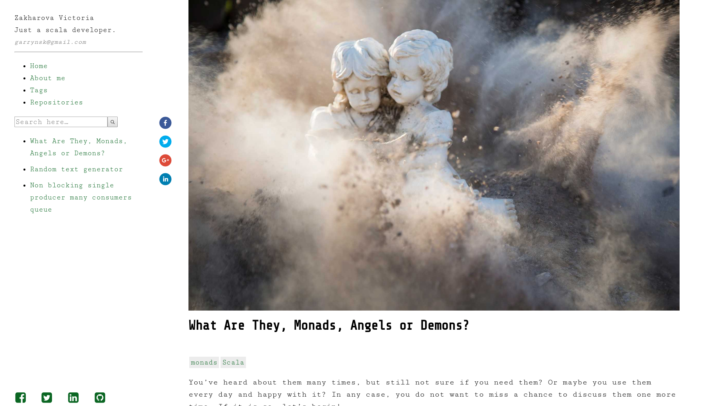
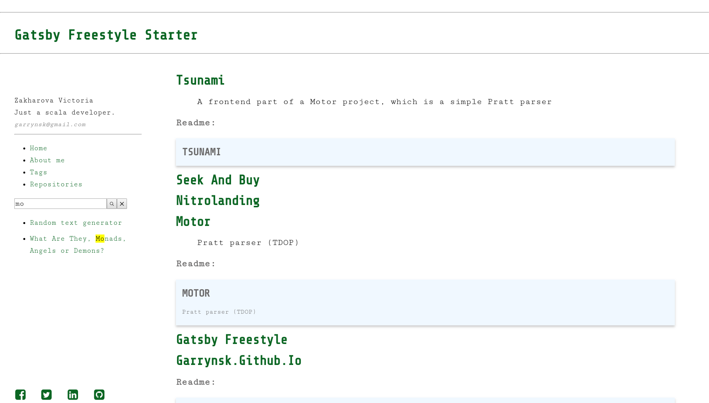

<div style="color: #f55; font-weight: bold; font-size: 2.5em; margin-left: 15%;">Gatsby Freestyle Starter</div>

The Gatsby starter with typescript and a lot of goodies.

It is a project for building blogs, especially programming blogs, as it can extract a list of repos via GitHub api. It also includes tags, comments, search, social buttons and SEO support.

#### Posts

#### Repositories

## How to install

Verify if npm and node are installed on your machine:

```bash
    node -v && npm -v
```

Otherwise, install them:

```bash
    // For Ubuntu
    sudo apt-get install npm
    sudo apt-get install node
```

Install the starter:

```bash
gatsby new YourProjectName https://github.com/garrynsk/gatsby-freestyle-starter
```

If you want to configure installed plugins, navigate to gatsby-config.js in the root directory and edit it as you wish.

## The list of preinstalled plugins
Feel free to configure them.

#### Images/Video

1. [gatsby-image](https://www.gatsbyjs.org/packages/gatsby-image/?=gatsby-image#gatsby-image)
Speedy, optimized images without the work.

2. [gatsby-remark-responsive-image](https://www.gatsbyjs.org/packages/gatsby-remark-responsive-image/?=gatsby-remark-responsive-image#gatsby-remark-responsive-image)
Make images in markdown responsive.

3. [gatsby-plugin-sharp](https://www.gatsbyjs.org/packages/gatsby-plugin-sharp/?=gatsby-plugin-sharp#gatsby-plugin-sharp)
Exposes several image processing functions built on the Sharp image processing library.

4. [gatsby-remark-images](https://www.gatsbyjs.org/packages/gatsby-remark-images/?=gatsby-remark-images#gatsby-remark-images)
Processes images in markdown so they can be used in the production build.

5. [gatsby-remark-responsive-iframe](https://www.gatsbyjs.org/packages/gatsby-remark-responsive-iframe/?=gatsby-remark-responsive-iframe#gatsby-remark-responsive-iframe)
Wraps iframes or objects (e.g. embedded YouTube videos) within markdown files in a responsive elastic container with a fixed aspect ratio.

6. [gatsby-transformer-sharp](https://www.gatsbyjs.org/packages/gatsby-transformer-sharp/?=gatsby-transformer-sharp#gatsby-transformer-sharp)
Creates ImageSharp nodes from image types that are supported by the Sharp image processing library and provides fields in their GraphQL types for processing your images in a variety of ways including resizing, cropping, and creating responsive images.

#### Code blocks

1. [gatsby-remark-prismjs](https://www.gatsbyjs.org/packages/gatsby-remark-prismjs/?=gatsby-remark-prismjs#gatsby-remark-prismjs)
Adds syntax highlighting to code blocks in markdown files using PrismJS.

#### SEO

1. [gatsby-plugin-sitemap](https://www.gatsbyjs.org/packages/gatsby-plugin-sitemap/?=gatsby-plugin-sitemap#gatsby-plugin-sitemap)
Create a sitemap for your Gatsby site.

2. [gatsby-plugin-facebook-analytics](https://www.gatsbyjs.org/packages/gatsby-plugin-facebook-analytics/?=#gatsby-plugin-facebook-analytics)
Easily add Facebook Analytics to your Gatsby site.

3. [gatsby-plugin-google-analytics](https://www.gatsbyjs.org/packages/gatsby-plugin-google-analytics/?=gatsby-plugin-google-analytics#gatsby-plugin-google-analytics)
Easily add Google Analytics to your Gatsby site.

4. [gatsby-plugin-manifest](https://www.gatsbyjs.org/packages/gatsby-plugin-manifest/?=gatsby-plugin-manifest#gatsby-plugin-manifest)
Adds support for shipping a manifest.json with your site. To create manifest.json, you need to run gatsby build.

#### UX

1. [gatsby-plugin-offline](https://www.gatsbyjs.org/packages/gatsby-plugin-offline/?=gatsby-plugin-offline#gatsby-plugin-offline)
Adds drop-in support for making a Gatsby site work offline and more resistant to bad network connections. It creates a service worker for the site and loads the service worker into the client.

2. [gatsby-plugin-nprogress](https://www.gatsbyjs.org/packages/gatsby-plugin-nprogress/?=gatsby-plugin-nprogress#gatsby-plugin-nprogress)
Automatically shows the nprogress indicator when a page is delayed in loading (which Gatsby considers as one second after clicking on a link).

3. [gatsby-plugin-algolia](https://www.npmjs.com/package/gatsby-plugin-algolia)
Search powered by Algolia.
#### Dev tools

1. [gatsby-plugin-webpack-bundle-analyzer](https://www.gatsbyjs.org/packages/gatsby-plugin-webpack-bundle-analyzer/?=gatsby-plugin-webpack-bundle-analyzer#gatsby-plugin-webpack-bundle-analyzer)
A Gatsby plugin to help analyze your bundle content with [webpack-bundle-analyzer](https://github.com/webpack-contrib/webpack-bundle-analyzer).

2. [gatsby-plugin-debug-build](https://www.gatsbyjs.org/packages/gatsby-plugin-debug-build/?=#gatsby-plugin-debug-build)
Gatsby plugin to force the dev version of builds. NOT FOR USE IN PRODUCTION. This is a debugging utility. Don’t do stupid things with it.

#### Helpers

1. [gatsby-link](https://www.gatsbyjs.org/packages/gatsby-link/?=gatsby-link#gatsby-link)
A <Link> component for Gatsby. It’s a wrapper around React Router’s Link component that adds enhancements specific to Gatsby. All props are passed through to React Router’s Link.

2. [gatsby-plugin-catch-links](https://www.gatsbyjs.org/packages/gatsby-plugin-catch-links/?=gatsby-plugin-catch-links#gatsby-plugin-catch-links)
Intercepts local links from markdown and other non-react pages and does a client-side pushState to avoid the browser having to refresh the page.

3. [gatsby-remark-copy-linked-files](https://www.gatsbyjs.org/packages/gatsby-remark-copy-linked-files/?=gatsby-remark-copy-linked-files#gatsby-remark-copy-linked-files)
Copies local files linked to/from markdown to your public folder.

4. [gatsby-transformer-remark](https://www.gatsbyjs.org/packages/gatsby-transformer-remark/?=gatsby-transformer-remark#gatsby-transformer-remark)
Parses Markdown files using Remark.

5. [gatsby-plugin-fastclick](https://www.gatsbyjs.org/packages/gatsby-plugin-fastclick/?=#gatsby-plugin-fastclick)
Make your Gatsby app more responsive on touch devices with [Fastclick](https://github.com/ftlabs/fastclick).

6. [gatsby-plugin-react-helmet](https://www.gatsbyjs.org/packages/gatsby-plugin-react-helmet/?=gatsby-plugin-react-helmet#gatsby-plugin-react-helmet)
Provides drop-in support for server rendering data added with React Helmet. React Helmet is a component which lets you control your document head using their React component.

7. [gatsby-remark-smartypants](https://www.gatsbyjs.org/packages/gatsby-remark-smartypants/?=gatsby-remark-smartypants#gatsby-remark-smartypants)
Replaces “dumb” punctuation marks with “smart” punctuation marks using the retext-smartypants plugin.

8. [gatsby-source-filesystem](https://www.gatsbyjs.org/packages/gatsby-source-filesystem/?=gatsby-source-filesystem#gatsby-source-filesystem)
Plugin for creating File nodes from the file system. 

#### Language

1. [gatsby-plugin-typescript](https://www.gatsbyjs.org/packages/gatsby-plugin-typescript/?=gatsby-plugin-typescript#gatsby-plugin-typescript)
Provides drop-in support for TypeScript and TSX.

#### Social

1. [gatsby-source-github-api](https://github.com/ldd/gatsby-source-github-api)
Source plugin for pulling data into Gatsby from the official GitHub v4 GraphQL API.

2. [gatsby-remark-autolink-headers](https://www.gatsbyjs.org/packages/gatsby-remark-autolink-headers/?=gatsby-remark-autolink-headers#gatsby-remark-autolink-headers)
Adds GitHub-style links to MarkdownRemark headers.

## Features

Posts in markdown
- [x] Code syntax highlighting
- [x] Embedded YouTube videos
- [x] Embedded Tweets
- [x] Embedded Facebook posts
- [x] Embedded Reddit comments

Special blog features
- [x] Tags
- [x] Disqus comments
- [x] List of Github repositories
- [x] Search

Social features
- [x] Twitter tweet button
- [x] Facebook share button
- [x] Google+ share button
- [x] LinkedIn share button

SEO
- [x] Sitemap generation
- [x] robots.txt
- [x] Meta descriptions
- [x] Schema.org
- [x] OpenGraph Tags
- [x] Twitter Tags
- [x] Google analytics
- [x] Web App Manifest

Development tools
- [x] TSLint for linting
- [x] Prettier for code style
- [x] Remark-Lint for linting Markdown
- [x] write-good for linting English prose
- [x] gh-pages for deploying to GitHub pages

Lazyboy tools
- [ ] plop template

## Customisation

#### Configuration
First, look as config.js. Here you keep all configuration data. It can be queried like this:
```graphql

export const query = graphql`
  query AboutQuery {
    site {
      siteMetadata {
        siteUrl
        siteTitle
        userEmail
        userName
        userMoto
        year
        githubUrl
        facebookUrl
        twitterUrl
        linkednUrl
        ... // other configuration data
      }
    },
}
```

#### Posts

To define custom tags you need to write them in every post in the blok at the beginning of the post. Like this:

```markdown
---
title: "What Are They, Monads, Angels or Demons?"
date: "2018-03-26T10:30:00.000Z"
author: "Zakharova Victoria"
path: "/monads"
featuredImage: "./angels.jpg"
tags: ["monads", "Scala"]
---
```
Every post has it's featured image, which will be shown on the Home page and in the post itself. You should it define in the every post too.

#### Plugins

Your plugins can be configurated in gatsby-node.js.

1. gatsby-source-github-api
You must provide token and graphQL query.

2. gatsby-plugin-webpack-bundle-analyzer
Is disabled by default. If you need it, change the value of the "disable" parameter.

3. gatsby-plugin-google-analytics
You must provide trackingId

4. gatsby-plugin-facebook-analytics
5. You must provide appId
        
#### Social

For social buttons is used react-share. You can configure it in templates/post.tsx.

For social icons is used react-icons/lib/fa. You can configure it in layouts/footer.tsx

In the file parser/parser.tsx is stored a parser for google API.

#### Embed 

You can include or exclude scripts for embed links from templates/post.tsx. They are defined in the block:


#### Custom css

Every tsx file has its own css file.You can define your own or restyle the blog with any other languages.

Global css files are stored in static/css/

* code-highlight.css
* global.css
* normalize.css


```html
    <Helmet>
        <script async src="https://connect.facebook.net/en_US/sdk.js#xfbml=1&amp;version=v2.5" type="text/javascript"></script>
        <script async src="https://www.redditstatic.com/comment-embed.js" type="text/javascript"></script>
        <script async src="https://platform.twitter.com/widgets.js" charset="utf-8" type="text/javascript"></script>
        
    </Helmet>
```

#### Issues

Facebook embed posts do not appear instantly. You need to reload the page to see it.


<div style="color: #f55; font-weight: bold; font-size: 3em; margin-left: 40%;">Enjoi!</div>
